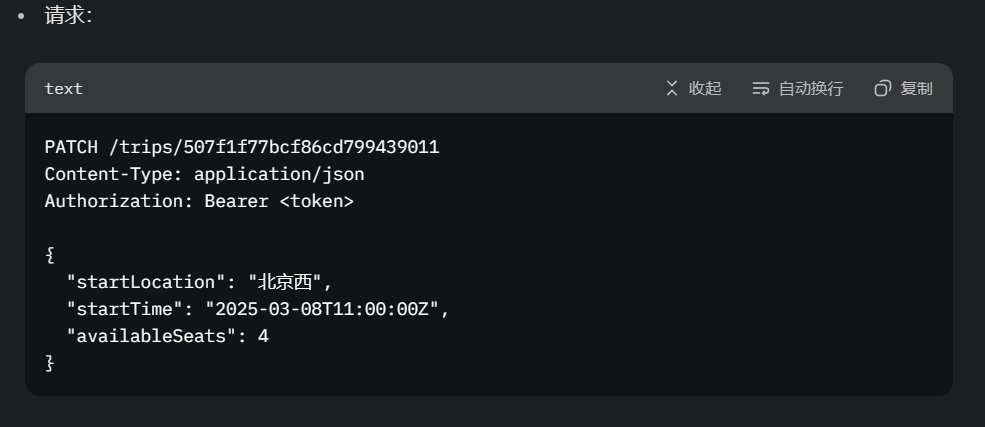

# MongoDB 学习笔记

## 项目更新记录

- 2025-01-11: 实现MVC架构
  - 创建controllers目录
  - 分离业务逻辑到product.controller.js
  - 重构路由使用controller方法
  - 添加createdAt和updatedAt时间戳

## 连接配置

- 连接时间：2025-01-11
- 测试接口：
  - GET /api/products
  - POST /api/products
  - PUT /api/products/:id
  - DELETE /api/products/:id
- 发现一个奇怪的 BUG 2025-3-6
  -乘客或司机退出登录后，再就行管理员登录会找不到路由，比如跳转到 name: system, 控制台会报错，但是路由是定义过的
  -

## 连接字符串
- 环境变量：`MONGO_URL`
- 默认值：`mongodb://localhost:27017`
- 当前配置：`mongodb://localhost:27017/test`

## 连接日志
成功连接时输出：
```
MongoDB Connected to database: product_db
Collections: [集合列表]
```

## 错误处理
- 连接失败时输出错误信息并退出进程
- 常见错误：
  - 连接超时
  - 认证失败
  - 网络不可达

## 最佳实践
1. 在生产环境中使用环境变量配置连接字符串
2. 添加重试机制
3. 使用连接池提高性能
   
## 项目目录结构
```
├── serve/                  # 后端代码
│   ├── config/             # 配置文件（如数据库连接）
│   ├── controllers/        # 控制器（处理请求逻辑）
│   ├── models/             # 数据模型（MongoDB Schema）
│   ├── routes/             # 路由（API端点）
│   ├── middleware/         # 中间件（如身份验证）
│   ├── utils/              # 工具函数（如JWT生成）
│   ├── app.js              # Express应用入口
│   └── server.js           # 服务器启动文件
├── client/                 # 前端代码
│   ├── public/             # 静态资源
│   ├── src/                # Vue.js源码
│   │   ├── assets/         # 静态资源（如图片）
│   │   ├── components/     # Vue组件
│   │   ├── router/         # 路由配置
│   │   ├── store/          # Vuex状态管理
│   │   ├── views/          # 页面视图
│   │   ├── App.vue         # 根组件
│   │   └── main.js         # 前端入口文件
│   └── package.json        # 前端依赖管理
├── .env                    # 环境变量配置文件
└── README.md               # 项目说明文档
```


## 拼车业务场景
- driverId：在订单创建时，driverId 字段是空的或未定义，因为还没有司机接单。
- tripId：如果订单是即时拼车，乘客可能只指定起点和终点，系统需要匹配行程（由司机提供），此时 tripId 可能在订单创建后才确定。
-状态管理：订单状态为 pending 时，缺乏明确的接单流程，可能导致订单“悬空”，即无人接单。
- 即时拼车：乘客发布订单，系统匹配附近司机，司机接单后分配 driverId 和 tripId。
- 预约拼车：乘客预订特定时间和地点的行程，tripId 可能在创建时已知，但 driverId 仍需等待司机确认。
- 待接单阶段：订单创建后，等待司机接单，这段时间内 driverId 和 tripId 的不确定性需要处理。

```
订单流程->提交订单(状态：待接单)->匹配司机确认(状态：已接单)->订单完成(状态：已完成)

订单创建阶段：
  乘客提交订单，指定座位数、金额、支付方式和行程需求（起点、终点、时间）。
  初始状态设为 pending 或 pending_match，driverId 和 tripId 为空。
  系统记录 requestedTripDetails 或直接关联到可能的 tripId（如果有预设行程）。
匹配和接单阶段：
  系统或管理员匹配附近司机，通知潜在司机。
  司机接单后，更新 driverId 和 tripId（如果需要生成新行程）。
  状态更新为 confirmed，并通知乘客。
超时处理：
如果一定时间内（例如 30 分钟）无人接单，订单状态自动变为 cancelled，并通知乘客。
```
## 状态流转图
pending → matched → confirmed → completed
pending → cancelled
matched → cancelled
confirmed → cancelled

## 订单路由
1. 创建订单
路由：POST /
描述：乘客创建新订单，指定行程需求（起点、终点、时间）、座位数、金额和支付方式，初始状态为 pending_match，driverId 和 tripId 为空。
用途：启动订单流程，等待司机接单。
2. 获取订单详情
路由：GET /:id
描述：根据订单ID查询订单详细信息，包括状态、支付信息、评价等，适用于乘客、司机和管理员，需验证订单归属。
用途：查看订单具体内容。
3. 更新订单状态
路由：PATCH /:id
描述：司机或管理员更新订单状态（如从 matched 到 confirmed，或 confirmed 到 completed），需验证权限和状态转换合法性。
用途：管理订单进度。
4. 取消订单
路由：DELETE /:id
描述：乘客、司机或管理员取消订单，更新状态为 cancelled，记录取消原因，支持退款（如果已支付），适用于任意状态。
用途：处理订单取消需求。
5. 获取用户订单列表
路由：GET /users/:userId
描述：查询指定用户的订单列表，按创建时间排序，可按状态过滤，乘客只能查看自己的订单，管理员无限制。
用途：查看用户历史订单。
6. 获取行程相关订单
路由：GET /trips/:tripId
描述：查询指定行程下的所有订单，司机只能查看自己行程的订单，管理员无限制，可按状态过滤。
用途：司机或管理员查看行程订单。
7. 确认订单
路由：PATCH /:id/confirm
描述：司机或乘客确认订单，状态从 matched 变为 confirmed，需验证权限和订单归属。
用途：完成接单和确认流程。
8. 更新支付状态
路由：PATCH /:id/payment
描述：乘客或管理员更新支付状态（如从 unpaid 到 paid，或 paid 到 refunded），记录支付时间，支持退款逻辑。
用途：管理支付流程。
9. 提交订单评价
路由：POST /:id/rate
描述：乘客或司机提交订单评价，更新 rating 和 comment 字段，限制于 completed 状态的订单。
用途：记录服务反馈。
10. 检查订单过期
路由：GET /check-expiration（或作为后台任务）
描述：系统检查 pending_match 状态的订单，超过指定时间（例如 30 分钟）自动取消，更新为 cancelled。
用途：清理过期订单，释放资源。

## 评价路由

查看订单的评价
路由：GET /orders/:orderId/reviews
描述：查询指定订单的评价列表。

查看用户的评价列表
路由：GET /users/:userId/reviews
描述：查询指定用户的评价（作为评价者或被评价者）。

GET /reviews/admin/overview（查看所有评价概览）
GET /reviews/admin/drivers/:driverId/stats（查看司机评价统计）

GET /reviews/admin/passengers/:passengerId/stats（查看乘客评价统计）


GET /reviews/admin/orders/:orderId/stats（查看订单相关评价统计）


## 行程路由
1. 创建行程
路由：POST /trips
描述：司机创建新行程，设置起点、终点、出发时间、座位数和价格，状态默认为 pending。

2. 查看行程详情
路由：GET /trips/:tripId
描述：司机或管理员查看指定行程的详细信息（包括行程编号、位置、时间、状态、可用座位等）。


3. 更新行程信息
路由：PATCH /trips/:tripId
描述：司机或管理员修改行程的起点、终点、出发时间、座位数或价格（仅限 pending 或 scheduled 状态）。



4. 取消行程
路由：PATCH /trips/:tripId/cancel
描述：司机或管理员取消行程，更新状态为 cancelled，同步关联订单状态为 cancelled，释放座位。


5. 启动行程
路由：PATCH /trips/:tripId/start
描述：司机启动行程，状态从 scheduled 改为 in_progress，验证至少一个 confirmed 订单，通知乘客。

6. 完成行程
路由：PATCH /trips/:tripId/complete
描述：司机完成行程，状态从 in_progress 改为 completed，同步关联订单状态为 completed，触发评价流程。

7. 查看司机行程列表
路由：GET /trips/driver/:driverId
描述：司机或管理员查看指定司机创建的所有行程，支持分页和状态筛选。

8. 查看行程关联订单
路由：GET /trips/:tripId/orders
描述：司机或管理员查看指定行程下所有关联订单，支持分页。

10. 检查可用座位
路由：GET /trips/:tripId/seats
描述：查询行程当前剩余可用座位数，基于订单动态计算。


## 用户路由 管理乘客司机信息
个人信息更新：修改姓名、头像、联系方式等。
账户状态：正常、限制（如因信用分低被限制发布行程）。

通知列表：查看系统通知（行程状态变更、司机消息）。
通知设置：设置通知偏好（短信、推送）。

支付记录：查看拼车订单的支付历史。

实名认证：上传身份证信息，验证真实身份。
驾驶资质认证：上传驾驶证、行驶证，验证驾驶资格。
车辆信息登记：登记车辆信息（车牌号、车型、座位数）。

修改密码：通过旧密码或验证码修改。
找回密码：通过手机号验证码重置密码。


# 用户页面架构
导航栏，首页，个人中心，评价信息，历史订单，


## 前端页面
- 首页：显示热门行程和最新订单。
- 登录：用户登录和注册。
- 个人中心：用户个人信息和设置。
- 历史订单：用户查看历史订单。
- 评价信息：用户查看评价信息。
- 行程详情：司机查看行程详情和操作。
- 订单详情：用户查看订单详情和操作。
- 搜索：用户搜索行程。
- 创建行程：司机创建行程。

# 管理员乘客管理接口
- 管理员查看乘客信息：管理员查看乘客信息。
  ```
    {
      "code": 200,
      "data": {
        "total": 100,
        "records": [
          {
            "id": "60d5f484f5a4b12b8c8d4e1a",
            "username": "passenger1",
            "phone": "13812345678",
            "role": "passenger",
            "lastLogin": "2025-03-20T10:00:00.000Z",
            "profile": {
              "name": "张三",
              "idNumber": "110101199003071234",
              "avatar": "https://example.com/avatar.jpg",
              "birthDate": "1990-03-07",
              "gender": "male",
              "rating": 4.5,
              "defaultPaymentMethod": "alipay",
              "status": "online"
            },
            "createdAt": "2025-03-01T08:00:00.000Z",
            "updatedAt": "2025-03-20T10:00:00.000Z"
          },
          // 更多记录...
        ]
      },
      "message": "获取乘客列表成功"
    }
  ```
- 管理员修改乘客信息
  参数
  ```
  {
    "username": "newPassenger1", // 可选
    "phone": "13887654321", // 可选
    "profile": {
      "name": "李四", // 可选
      "idNumber": "110101199003071235", // 可选
      "avatar": "https://example.com/new-avatar.jpg", // 可选
      "birthDate": "1990-03-08", // 可选
      "gender": "female", // 可选
      "defaultPaymentMethod": "wechat", // 可选
      "status": "locked" // 可选
    },
    "notificationSettings": { // 可选
      "orderNotifications": true,
      "paymentNotifications": false,
      "reviewNotifications": true,
      "systemNotifications": true
    }
  }
  ```
  响应
  ```
  {
    "code": 200,
    "data": {
      "id": "60d5f484f5a4b12b8c8d4e1a",
      "username": "newPassenger1",
      "phone": "13887654321",
      "role": "passenger",
      "lastLogin": "2025-03-20T10:00:00.000Z",
      "profile": {
        "name": "李四",
        "idNumber": "110101199003071235",
        "avatar": "https://example.com/new-avatar.jpg",
        "birthDate": "1990-03-08",
        "gender": "female",
        "rating": 4.5,
        "defaultPaymentMethod": "wechat",
        "status": "locked"
      },
      "notificationSettings": {
        "orderNotifications": true,
        "paymentNotifications": false,
        "reviewNotifications": true,
        "systemNotifications": true
      },
      "createdAt": "2025-03-01T08:00:00.000Z",
      "updatedAt": "2025-03-22T10:00:00.000Z"
    },
    "message": "乘客信息更新成功"
  }
  ```
- 管理员查看乘客订单信息
  ```
    "code": 200,
    "data": {
      "orders": {
        "total": 50,
        "records": [
          {
            "id": "60d5f484f5a4b12b8c8d4e2b",
            "orderNumber": "ORD123456",
            "status": "completed",
            "totalPrice": 100,
            "paymentStatus": "paid",
            "seatCount": 2,
            "trip": {
              "startLocation": "北京",
              "endLocation": "上海",
              "startTime": "2025-03-20T08:00:00.000Z"
            },
            "createdAt": "2025-03-20T07:00:00.000Z"
          },
          // 更多订单...
        ]
      },
    },
    "message": "获取乘客订单信息成功"
  ```
- 管理员查看乘客评价信息
  ```
    "code": 200,
    "data": {
      "reviews": {
        "total": 20,
        "records": [
            {
              "id": "60d5f484f5a4b12b8c8d4e3c",
              "orderId": "60d5f484f5a4b12b8c8d4e2b",
              "rating": 4,
              "comment": "服务很好",
              "createdAt": "2025-03-20T09:00:00.000Z"
            },
            // 更多评价...
          ]
      },
    },
    "message": "获取乘客评价信息成功"
  ```


# 管理员司机管理接口
- 获取司机信息：
  参数：
  ```
    current（可选，默认为 1）：当前页码。
    size（可选，默认为 10）：每页条数。
    username（可选）：按用户名筛选（模糊匹配）。
    phone（可选）：按手机号筛选（精确匹配）。
    status（可选）：按用户状态筛选（offline、online、locked）。
    gender（可选）：按性别筛选（male、female、other）。
    ratingMin（可选）：按最低评分筛选。
    ratingMax（可选）：按最高评分筛选。
    licensePlate（可选）：按车牌号筛选（模糊匹配）。
    vehicleModel（可选）：按车型筛选（模糊匹配）。
  ```
  返回数据：
  ```
    {
      "code": 200,
      "data": {
        "total": 50,
        "records": [
          {
            "id": "60d5f484f5a4b12b8c8d4e2b",
            "username": "driver1",
            "phone": "13912345678",
            "role": "driver",
            "lastLogin": "2025-03-20T10:00:00.000Z",
            "profile": {
              "name": "王五",
              "idNumber": "110101198503071234",
              "avatar": "https://example.com/avatar-driver.jpg",
              "birthDate": "1985-03-07",
              "gender": "male",
              "rating": 4.8,
              "licensePlate": "鲁A12345",
              "vehicleModel": "Toyota Camry",
              "status": "online"
            },
            "createdAt": "2025-03-01T08:00:00.000Z",
            "updatedAt": "2025-03-20T10:00:00.000Z"
          },
          // 更多记录...
        ]
      },
      "message": "获取司机列表成功"
    }
  ```
- 修改司机信息:
- 查看司机订单和评价信息:
